# xp_ui

 

Windows Xp UI components for Flutter apps, inspired on [flutter95](https://pub.dev/packages/flutter95) and [fluent_ui](https://pub.dev/packages/fluent_ui)

## Screenshots


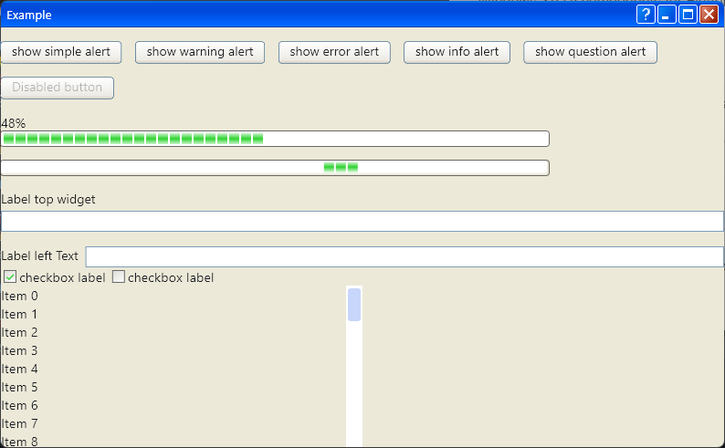

## Installation
Add this to your package's `pubspec.yaml` file:
```yaml
dependencies:
  xp_ui: ^0.0.1
```
To hide the native title bar and enable the maximize and minimize buttons install `window_manager` package. See [Documentation](https://pub.dev/packages/window_manager)

## Components

#### XpApp

Required to load all Xp styles, is compatible with standart flutter material Widgets.

```dart
 XpApp(
    title: 'Flutter Demo',
    theme: XpThemeData(),
    debugShowCheckedModeBanner: false,
    home: const MyHomePage(title: 'Flutter Demo Home Page'),
);
```

#### TitleBar
Provides the window title bar with customizable 4 action button.
> [!CAUTION]
> The [window_manager](https://pub.dev/packages/window_manager) package is required to work.

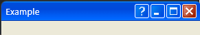
```dart
Scaffold(
    appBar: TitleBar(
        'Example',
        showHelpButton: true,
        showMaximizeButton: true,
        showMinimizeButton: true,
        showCloseButton: true,
        onHelpButtonPressed: () {},
      )
)
```

#### Button

 

```dart
 Button(
    child: const Text('Cancel'),
    onPressed: () {},
)
```

#### ProgressBar

you can provide a value between 0-100 to show progress, or null to show an indeterminated progress.

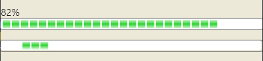

```dart
ProgressBar(
    value: 82.0
)
```

#### Checkbox

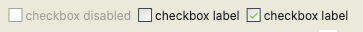

```dart
XpCheckbox(
    value: true,
    label: 'checkbox label',
    onChanged: (value) {}
)
XpCheckbox(
    value: false,
    label: 'checkbox label',
    onChanged: (value) {}
)
```

#### Textbox

The label can be a String or a Widget, is positioned by default on the top.

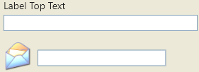

```dart
Textbox(
    labelText: 'Label Top Text',
)
            
Textbox(
    labelWidget: SystemIcon(icon: XpSystemIcons.email),
    labelPosition: TextboxLabelPosition.left,
)
```
#### Dialogs
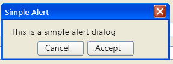
```dart
 showXpDialog(
    context: context,
    builder: (context) => const XpAlertDialog(
                    title: 'Simple Alert',
                    content: const Text('This is a simple alert dialog'),
                    actions: [
                            Button(
                                child: const Text('Cancel'),
                                onPressed: () {},
                                ),
                            Button(
                                child: const Text('Accept'),
                                onPressed: () {},
                                )
                            ],
                  ));
```
```dart
AlertType.error;
```
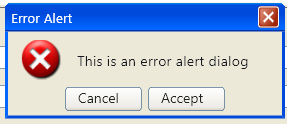
```dart
AlertType.warning;
```
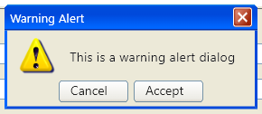
```dart
AlertType.question;
```
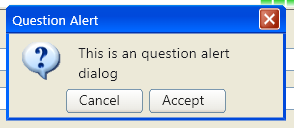
```dart
AlertType.info;
```
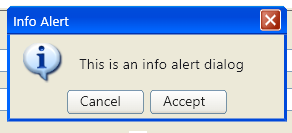
```dart
AlertType.success;
```
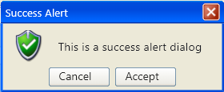

<hr>

### Contributing

You can contribute in different ways:

- Creating new Windows95 styled components.
  - Please include screenshots in your PRs!
  - Please update the example and tests to include the new component!
- Improving existing components with better options.
- Improving documentation both in code and this README file.
- Fixing lint issues.
- Creating feature requests.
  - Please include a screenshot.
  - Also don't expect a quick response, this is a hobby project.
- Reporting bugs. 